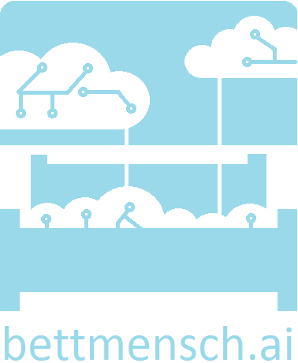

# :hotel: Welcome to Bettmensch.AI

:factory: Bettmensch.AI is a Kubernetes native open source platform for GitOps based ML workloads that allows for tight CI and CD integrations.

# Features (under active development )

## :computer: Dashboard

:eyes: A dashboard for *monitoring* all workloads running on the platform.

:open_hands: To actively *manage* `Pipeline`s, `Flow`s, please see the respective documentation of `bettmensch.ai` SDK.

## :twisted_rightwards_arrows: `Pipelines & Flows`

`bettmensch.ai` comes with a python SDK for defining and executing distributed (ML) workloads by leveraging the [`ArgoWorkflows`](https://argoproj.github.io/workflows/) framework and the official [`hera`](https://github.com/argoproj-labs/hera) library.

## :books: `Models`

Coming soon.

## :rocket: `Servers`

Coming soon.