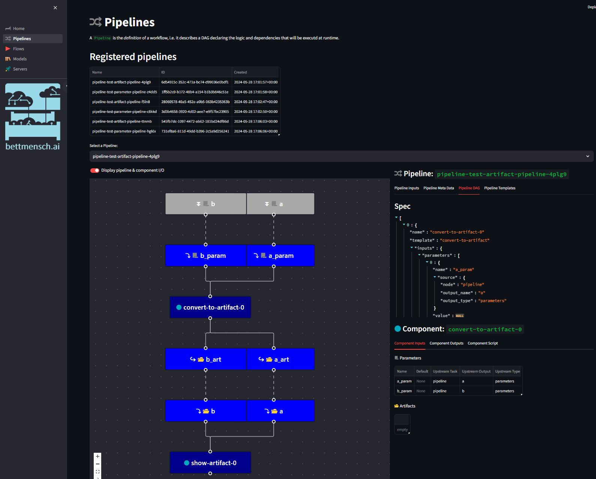
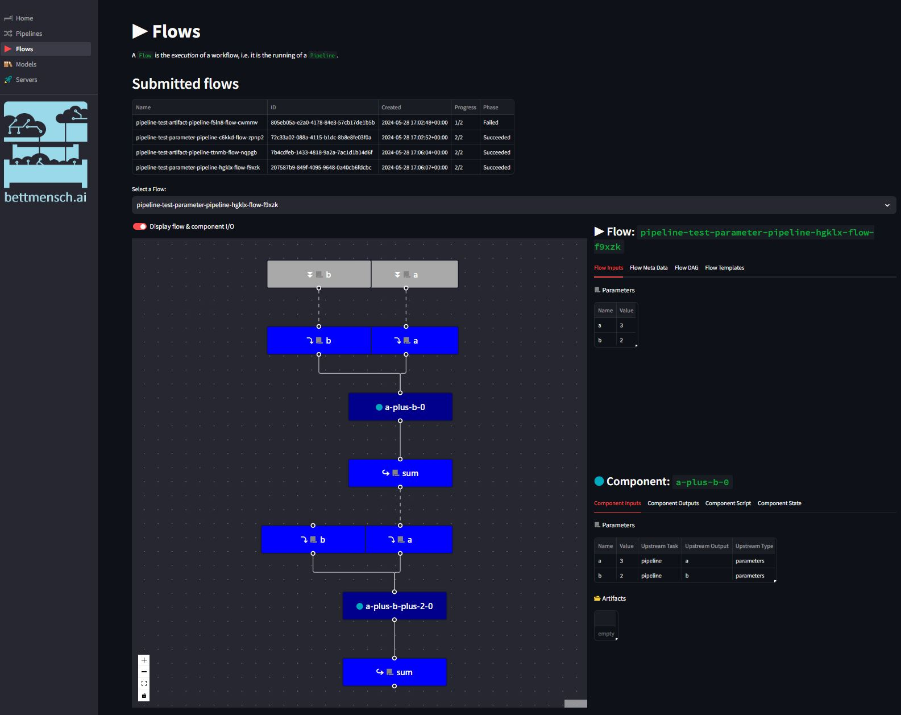

# :hotel: Welcome to Bettmensch.AI


Bettmensch.AI is a Kubernetes native open source platform for GitOps based ML workloads that allows for tight CI and CD integrations.


# :twisted_rightwards_arrows: CI

The `.github/workflows` directory contains all Github Actions workflow files.

Their respective state can be seen at the top of this README.

# Setup

## :bridge_at_night: AWS Infrastructure & Kubernetes

Before you start, make sure you have the following on your machine:
- a working `terraform` installation
- a working `aws` CLI installation configured to your AWS account
- a dockerhub account `your-account`

To provision 
- the S3 bucket for the Argo Workflows artifact repository
- Karpenter required infrastructure (IAM, message queues, etc.)
- a working EKS cluster
- the configured Karpenter, Argo Workflows & Volcano kubernetes installations 
    on the cluster,

```bash
make platform.up
```

To port forward to 
- the `ArgoWorkflow` server running on EKS and
- the `Mlflow` server running on EKS,

run:

```bash
make platform.connect
```

When you're done, you can tear down the stack by running

```bash
make platform.down
```

## :computer: Dashboard

To build the `bettmensch.ai`'s custom dashboard's docker image, run:

```bash
make dashboard.build DOCKER_ACCOUNT=your-account
```

This will build the image and tag it locally with
- `your-account/bettmensch-ai-dashboard:3.11-<commit-sha>`
- `your-account/bettmensch-ai-dashboard:3.11-latest`

To push the image to the docker repository and make it accessible to the 
platform, run

```bash
make dashboard.push DOCKER_ACCOUNT=your-account
```

To run the dashboard locally, run:

```bash
make dashboard.run
```

See the `docker` directory for more details.

## :books: Python SDK installation

To install the python library `bettmensch_ai` with `torch-pipelines` support,
 run 
 
```bash
make sdk.install EXTRAS=torch-pipelines
```

from the repository's top directory.

You can now start authoring `Pipeline`s and start submitting `Flow`s and 
start monitoring them on both the `ArgoWorkflow` as well as the `bettmensch.ai`
dashboards.

## :wrench: Running tests

To run unit tests for the python library, run

```bash
make sdk.test SUITE=unit
```

To run integration tests for the python library, run

```bash
make sdk.test SUITE=integration
```

To run K8s tests for the python library (requires a running and connected
bettmensch.ai platform), run

```bash
make sdk.test SUITE=k8s
```

# Features (under active development )

## :computer: Dashboard


:eyes: A dashboard for *monitoring* all workloads running on the platform.

:open_hands: To actively *manage* `Pipeline`s, `Flow`s, please see the 
respective documentation of `bettmensch.ai` SDK.

## :twisted_rightwards_arrows: `Pipelines & Flows`

### Overview

`bettmensch.ai` comes with a python SDK for defining and executing distributed
 (ML) workloads by leveraging the 
 [`ArgoWorkflows`](https://argoproj.github.io/workflows/) framework and the
  official [`hera`](https://github.com/argoproj-labs/hera) library. In this 
  framework, pipelines are DAGs with graph nodes implementing your custom logic
  for the given pipeline step, executed on K8s in a containerised step.

### Examples

The `io` module implements the classes implementing the transfer of inputs and
 outputs between a workfload's components.

Using `InputParameter` and `OutputParameter` for `int`, `float` or `str` type 
data:

```python
from bettmensch_ai.io import InputParameter, OutputParameter
from bettmensch_ai.components import component
from bettmensch_ai.pipelines import pipeline

@component
def add(
    a: InputParameter = 1,
    b: InputParameter = 2,
    sum: OutputParameter = None,
) -> None:

    sum.assign(a + b)

@pipeline("test-parameter-pipeline", "argo", True)
def a_plus_b_plus_2(a: InputParameter = 1, b: InputParameter = 2) -> None:
    a_plus_b = add(
        "a-plus-b",
        a=a,
        b=b,
    )

    a_plus_b_plus_2 = add(
        "a-plus-b-plus-2",
        a=a_plus_b.outputs["sum"],
        b=InputParameter("two", 2),
    )

a_plus_b_plus_2.export(test_output_dir)
a_plus_b_plus_2.register()
a_plus_b_plus_2.run(a=3, b=2)
```

Using `InputArtifact` and `OutputArtifact` for all other types of data, 
leveraging AWS's `S3` storage service:

```python
from bettmensch_ai.io import InputArtifact, OutputArtifact
from bettmensch_ai.components import component
from bettmensch_ai.pipelines import pipeline

@component
def convert_to_artifact(
    a_param: InputParameter,
    a_art: OutputArtifact = None,
) -> None:

    with open(a_art.path, "w") as a_art_file:
        a_art_file.write(str(a_param))

@component
def show_artifact(a: InputArtifact) -> None:

    with open(a.path, "r") as a_art_file:
        a_content = a_art_file.read()

    print(f"Content of input artifact a: {a_content}")

@pipeline("test-artifact-pipeline", "argo", True)
def parameter_to_artifact(
    a: InputParameter = "Param A",
) -> None:
    convert = convert_to_artifact(
        "convert-to-artifact",
        a_param=a,
    )

    show = show_artifact(
        "show-artifact",
        a=convert.outputs["a_art"],
    )

parameter_to_artifact.export(test_output_dir)
parameter_to_artifact.register()
parameter_to_artifact.run(a="Test value A")
```

**NOTE**: For more examples (including cross K8s node CPU and GPU `torch.distributed` 
processes), see this repository's [integration `test`](./sdk/test/integration/)
 and [k8s `test`](./sdk/test/k8s/) sections.

The submitted pipelines can be viewed on the dashboard's `Pipelines` section:



The executed flows can be viewed on the dashboard's `Flows` section:



### Building images

To build a 
- `standard`,
- `pytorch`, or
- `pytorch-lightning`

docker image to be used for the pipeline components, run

```bash
make component.build DOCKER_ACCOUNT=your-account COMPONENT=standard # pytorch, pytorch-lightning
```

This will build the image and tag it locally with
- `your-account/bettmensch-ai-standard:3.11-<commit-sha>`
- `your-account/bettmensch-ai-standard:3.11-latest`

To push the image to the docker repository and make it accessible to the 
platform, run

```bash
make component.push DOCKER_ACCOUNT=your-account COMPONENT=standard # pytorch, pytorch-lightning
```

By default, the components will use the
- `standard` image for the `Component` class
- `pytorch` image for the `DDPComponent` class

See the `k8s` `ddp` test cases for how to use the `pytorch-lightning` image for
the `DDPComponent`.

## How it works

The following sequence diagram illustrates how the creation, registration and
 running of `Pipeline`'s is supported by the infrastructure stack initiated in
 the `Setup` section:


## :books: `Models`


Coming soon.

## :rocket: `Servers`


Coming soon.

# Credits

This platform makes liberal use of various great open source projects:
- [ArgoWorkflows](https://argoproj.github.io/workflows/): Kubernetes native 
workload orchestration. Also powers the popular
 [Kubeflow Pipelines](https://github.com/kubeflow/pipelines), which inspired 
 the `Pipelines` & `Flows` of this project.
- [hera](https://github.com/argoproj-labs/hera): Official Argo Python SDK for
 defining Workflow(Template)s
- [streamlit](https://streamlit.io/): A python library for designing 
interactive dashboards
  - [streamlit-flow-component](https://github.com/dkapur17/streamlit-flow): A
   [react-flow](https://reactflow.dev/) integration for streamlit
  - [st-pages](https://st-pages.streamlit.app/): A nice streamlit plugin for
   multi-page dashboards
- [mlflow](https://mlflow.org/): ML experiment tracking, model registry and
    serving support
